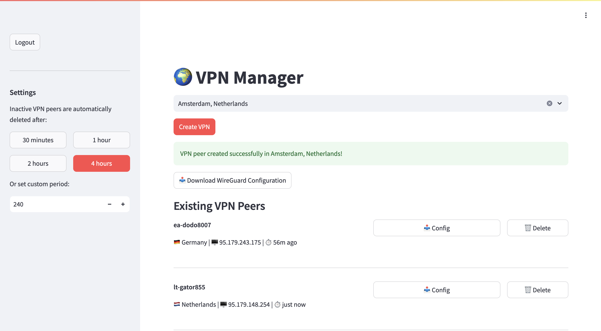

# WireGuard VPN Server Deployer and Manager
## Overview



This project aims to develop an open-source tool for deploying and managing WireGuard VPN servers across multiple cloud providers. The tool will provide a seamless way to:

- Deploy Servers: Create server instances on cloud providers like Vultr and Linode using Pulumi.
- Install WireGuard: Install and configure WireGuard on these servers using SSH-based management and scripts like wireguard-install.
- Manage Users: Create, manage, and delete VPN users on the deployed servers.
- Download Configurations: Provide WireGuard configuration files for each user-server pair.
- User Interfaces: Offer both a command-line interface (CLI) using Typer and a graphical interface using Streamlit.
- Data Storage: Store server and user information in an SQLite database for persistence.

To run the auto-vpn Docker image on your machine, follow the steps below.

Run Command

Use the following one-liner to start the container:

```
docker run --rm -d --pull always --name auto-vpn \
  -e USERNAME=admin \
  -e PASSWORD=qwerty \
  -e VULTR_API_KEY=<your-vultr-api-key> \
  -v $(pwd)/data_layer:/app/data_layer \
  -p 8501:8501 \
  ghcr.io/g1ibby/auto-vpn:main
```

## Notes
Make sure that `$(pwd)/data_layer` exists
## Environment Variables:
- USERNAME and PASSWORD: Required for admin access.
- Either VULTR_API_KEY or LINODE_API_KEY must be set for provider API integration.
- If DATABASE_URL is not set, a local SQLite database will be used at data_layer.db in the container. This is mapped to your current working directory.

Make sure to replace the placeholder values (e.g., VULTR_API_KEY) with your actual credentials.

This command will launch the auto-vpn service, accessible at http://localhost:8501.
